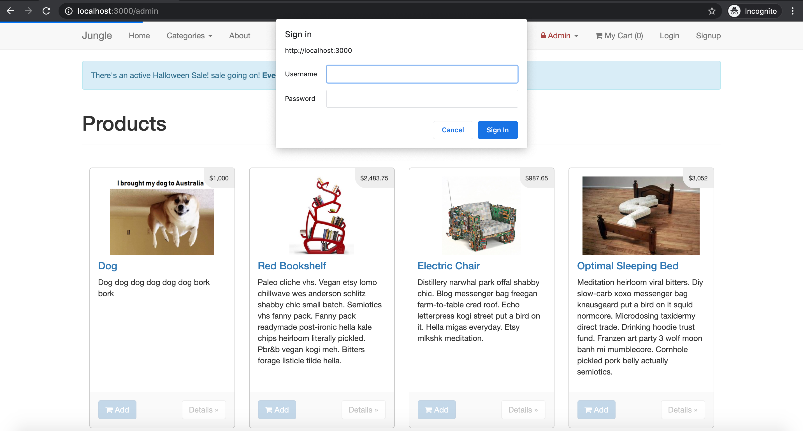

# Jungle

A mini e-commerce application built with Rails 4.2 for purposes of teaching Rails by example. This project was designed to emulate a real world situation where we are asked to work on an existing codebase in a language we aren't familiar with. We added new features, bug fixes and testing using RSpec and Capybara.

## Features

### Home Page

### About Page

### Admin Authentication

### Order Recap

### Shopping Cart

### Product Details

## Tech Stack

- Ruby on Rails
- Active Record (PSQL)
- CSS (Bootstrap)
- RSpec
- Capybara

## Setup

1. Run `bundle install` to install dependencies
2. Create `config/database.yml` by copying `config/database.example.yml`
3. Create `config/secrets.yml` by copying `config/secrets.example.yml`
4. Run `bin/rake db:reset` to create, load and seed db
5. Create .env file based on .env.example
6. Sign up for a Stripe account
7. Put Stripe (test) keys into appropriate .env vars
8. Run `bin/rails s -b 0.0.0.0` to start the server

## Stripe Testing

Use Credit Card # 4111 1111 1111 1111 for testing success scenarios.

More information in their docs: <https://stripe.com/docs/testing#cards>

## Dependencies

- Rails 4.2 [Rails Guide](http://guides.rubyonrails.org/v4.2/)
- PostgreSQL ^9.x
- Stripe

## Contact

Questions? Comments? Please get in touch via email <devhalpin86@gmail.com>
